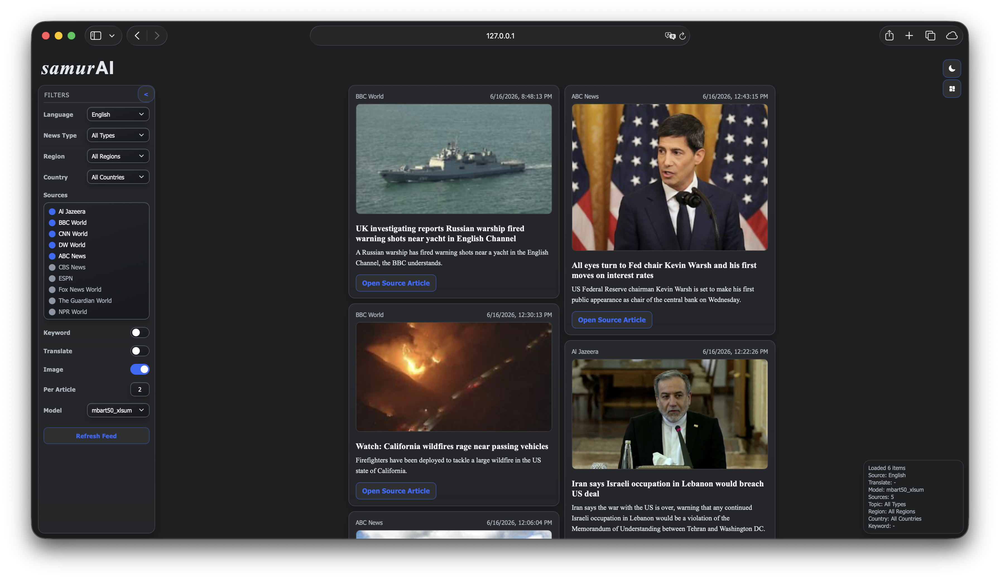

# samurAI

samurAI is a multilingual news summarization app. It reads recent articles from RSS feeds, extracts article text when possible, summarizes them with local transformer models, stores results in SQLite, and serves them through a Flask web interface and JSON API.



## What It Includes

- RSS news collection for 15 languages
- Article extraction with RSS fallback text
- Local summarization with BART, mBART, and mT5-style models
- Background ingestion and precomputed summaries
- SQLite storage for articles, summaries, model outputs, and ingest runs
- Flask web UI with filters for language, source, topic, model, keyword, images, and translation
- JSON endpoints for news summaries and ingest status
- Evaluation and model-training notebooks

## Project Structure

```text
app/          Flask app, routes, services, templates, static files
data/         Local datasets and generated data (not tracked)
docs/         Documentation assets
evaluation/   Evaluation scripts, metrics, and notebooks
models/       Local model folders and training notebooks
run_server.sh Convenience server launcher
tail_logs.sh  Convenience log follower
```

## Setup

Create the Python environment from the `app` directory:

```bash
cd app
python3 -m venv .venv
source .venv/bin/activate
pip install -r requirements.txt
```

Runtime summarization expects local model folders under `models/`. The main supported model keys are:

```text
bart_large_cnn
bart_base_cnn
bart_reuters
mbart50_xlsum
mbart-xlsum-2
mt5-xlsum
```

Expected local paths:

```text
models/bart_large-cnn/
models/bart_base-cnn/
models/bart_base-reuters/bart-reuters-best/
models/mbart50-xlsum/
models/mbart-xlsum-2/
models/mt5-xlsum/
```

For non-English sources, use one of the multilingual models:

```text
mbart50_xlsum, mbart-xlsum-2, mt5-xlsum
```

Optional translation uses:

```text
models/mbart-large-50-many-to-many-mmt/
```

## Run

From the project root:

```bash
./run_server.sh
```

The app runs at:

```text
http://localhost:8000
```

You can also run Flask directly:

```bash
cd app
source .venv/bin/activate
INGEST_ENABLED=1 INGEST_INTERVAL_SECONDS=900 python app.py
```

Useful environment variables:

```text
PORT=8000
FLASK_DEBUG=0
MODEL_KEY=mbart50_xlsum
LANGUAGE_KEY=en
NEWS_DB_PATH=app/news_data.db
INGEST_ENABLED=1
INGEST_INTERVAL_SECONDS=900
INGEST_LANGUAGES=en,tr,fr
INGEST_MODEL_KEYS=mbart50_xlsum,mt5-xlsum
INGEST_MAX_ITEMS_PER_RUN=60
TRANSLATION_MODEL_REF=/path/to/translation/model
```

Supported languages:

```text
en, tr, fr, de, es, it, ru, ar, hi, zh, ja, ko, nl, ro, vi
```

## API

Get stored summaries:

```bash
curl "http://localhost:8000/api/news?language=en&model=mbart50_xlsum&topic=world&limit=2"
```

Common query parameters:

```text
language          Source language key
output_language   Output language key
model             Summary model key
limit             Per-source result limit
sources           Comma-separated source keys
topic             Topic filter
country           Country filter
region            Region filter
keyword           Keyword filter
include_raw       Include full article text when true
```

Check ingest status:

```bash
curl "http://localhost:8000/api/ingest/status"
```

Trigger an ingest run:

```bash
curl -X POST "http://localhost:8000/api/ingest/run"
```

## Evaluation

Evaluation notebooks and scripts live in `evaluation/`:

```text
evaluation/pipelines/
evaluation/generate_eval_visualizations.py
evaluation/build_visualization_appendix.py
evaluation/metrics.txt
```

Generated reports, prediction files, figures, spreadsheets, datasets, caches, SQLite databases, logs, and model checkpoints are intentionally not committed.

## Git-Ignored Runtime Files

The repository excludes large or machine-local files such as:

```text
data/
app/.hf_cache/
app/news_data.db
app/logs/
models/*
evaluation/xlsum_eval_200/
evaluation/xlsum_eval_full/
evaluation/eval_visualizations/
evaluation/xlsum_dataset_analysis/
```
